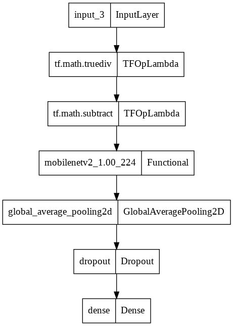

# Classifying Images of Concrete Using A Convolutional Neural Network

## 1. Summary
The aim of this project was to create a neural network that could accurately identify images of concrete that did or did not have cracks. The source of the dataset can be found [here](https://data.mendeley.com/datasets/5y9wdsg2zt/2).

## 2. IDE and Framework
This project was coded on Google Colab. The main frameworks used in this project are Numpy, Matplotlib and Tensorflow Keras.

## 3. Methodology

### 3.1. Data Pipeline
The image dataset was loaded already divided and labelled appropriately. Then, the data was split into train-validation sets, 70:30. The validation data was further divided 80:20 to obtain a test dataset. The overall train-validation-test split ratio is 70:24:6. No data augmentation was applied as the data size and variation are already sufficient.

### 3.2. Model Pipeline
The input layer is designed to receive coloured images with a dimension of 200x200. The full shape will be (200,200,3).

Transfer learning was applied for building the deep learning aspect of this model. Initially, we have a preprocessing layer that will change the pixel values of input images to a range of -1 to 1. This layer serves as the feature scaler and it is also a requirement for the transfer learning model to output the correct signals.

For feature extraction, a pretrained MobileNet v2 was used. The model is readily available within TensorFlow Keras package, with ImageNet pretrained parameters. It was also frozen so that it would not be specifically trained on our dataset.

A global average pooling and dense layer are used as the classifier to output softmax signals. The softmax signals are used to identify the predicted class.

The simplified illustration of the model is shown in the figure below.

The model is trained with a batch size of 32 and 10 epochs. After training, the model reaches 99% training accuracy and 95% validation accuracy. The training results are shown in the figures below.

 

## 4. Results
The model is evaluated with the test data. The loss and accuracy are shown in figure below.

Some predictions are also been made with the model, and compared with the actual results.

